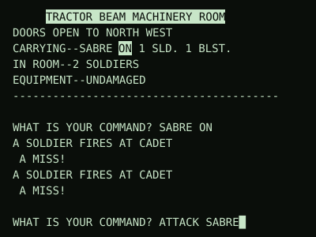

# Star Wars 1979 — JavaScript Port

A JavaScript / HTML port of
[Donald Brown's 1979 Applesoft BASIC text adventure **Star Wars** for the Apple ][](https://www.facebook.com/groups/5251478676/posts/10156900565763677/)
.
The original is a
[313-line BASIC program](https://archive.org/details/a2_cple_Apple_oids_Outpost_Star_Blaster_Star_Wars_Taxman)
;
this vibe-port is a single-page web app with the same
turn-based command loop, sound effects, and intentional Apple ][ quirks preserved (mostly) accurately.

## Play in browser: [hiddenwaffle.github.io/starwars/](https://hiddenwaffle.github.io/starwars/)

<div align="center">
<a href="https://hiddenwaffle.github.io/starwars/">

</a>
</div>

- Traditional typed input
- A live map
- A status panel, a palette of clickable command buttons with keyboard shortcuts, and an arrow d-pad
  for movement
- Sound effects synthesized via Web Audio at the same `(AB, AE, DN, CF)`
  parameters as BASIC's `CALL 770` speaker routine.
- Endgame scoring breakdown

The port is mostly **BASIC-faithful** — comments throughout cite BASIC line
numbers, and mechanics that *look* like bugs in the BASIC are preserved on
purpose (e.g., sabre damage `A1` = player.hp, so the sabre degrades as the
player takes damage; the soldier-defense pulls from `S(S9, 1)` even after a
kill; FOR-loop "scope-shadowing" escape from the title screen).

**Original game provenance:**

- [Facebook post with screenshots](https://www.facebook.com/groups/5251478676/posts/10156900565763677/)
  — how the game was identified.
- [Archive.org disk image](https://archive.org/details/a2_cple_Apple_oids_Outpost_Star_Blaster_Star_Wars_Taxman)
  — the disk containing the original BASIC source.
- [Apple ][ emulator](https://www.scullinsteel.com/apple2/#dos33master) —
  Scullinsteel's browser-based Apple ][, used to play the original as a
  reference for behavior and timing.

---

## Table of contents

- [Build and run](#build-and-run)
- [Deploying to GitHub Pages](#deploying-to-github-pages)
- [Project layout](#project-layout)
- [Architecture](#architecture)
- [Timing model](#timing-model)
- [Confirmed mechanics from the BASIC](#confirmed-mechanics-from-the-basic)
- [Scoring](#scoring)
- [Room data and map](#room-data-and-map)
- [Known quirks and traps](#known-quirks-and-traps)
- [BASIC source internals](#basic-source-internals)
- [Tests and audits](#tests-and-audits)
- [Dev panel](#dev-panel)
- [Endgame UI](#endgame-ui)
- [Pointers within the code](#pointers-within-the-code)
- [The BASIC source](#the-basic-source)

---

## Build and run

```sh
npm install
npm run build      # produces dist/star-wars-1979.html and docs/index.html
npm run dev        # esbuild watch mode; rebuilds on file change
npm run typecheck  # tsc --noEmit
npm test           # build + run all tests
```

The build output is a single self-contained HTML file with all CSS and JS
inlined. Open it directly in a browser; no server required.

`build.js` writes the same content to two paths:

- `dist/star-wars-1979.html` — what the tests load (file path is hard-coded
  in `tests/harness.js`).
- `docs/index.html` — the path GitHub Pages serves as the site root.

---

## Deploying to GitHub Pages

The repo is set up so that the `docs/` folder is committable and contains
the latest built game. To publish:

1. Build, then commit `docs/index.html`:

   ```sh
   node build.js
   git add docs/index.html
   git commit -m "Update build"
   git push
   ```

2. In repo Settings → Pages, choose:
   - Source: "Deploy from a branch"
   - Branch: `main`
   - Folder: `/docs`

After the first deploy, the game is live at
`https://<user>.github.io/<repo>/`. Re-run the three commands above any time
source changes should appear on the live site.

---

## Project layout

| Path | Purpose |
|------|---------|
| `src/game.ts` | Game logic — TypeScript, \~2,500 lines. |
| `src/index.html` | HTML/CSS shell with `<!-- GAME_SCRIPT -->` placeholder. |
| `build.js` | Build script: bundles TS via esbuild, inlines into HTML. |
| `dist/star-wars-1979.html` | Built output — what the test harness loads. Gitignored. |
| `docs/index.html` | Same built output, at the GitHub Pages site-root path. Committed. |
| `star-wars-1979.bas` | The original Applesoft BASIC source. 313 lines. Reference only — never modified. |
| `tests/test-*.js` | Headless test suite using jsdom. 13 active. |
| `tests/audit-*.js` | Out-of-band auditing scripts (timing measurement). Not part of `npm test`. |
| `tests/run-all.js` | Test runner — executes all active tests concurrently. |
| `tests/harness.js` | Shared jsdom bootstrap for tests; exposes `createGame(seed, opts)`. |

Most tests run in 1-3 seconds; the fuzzers (`test-aggressive`,
`test-targeted`) can take up to a minute. `tests/run-all.js` uses a 180s
per-test timeout to give the fuzzers comfortable headroom.

---

## Architecture

The HTML file is one big self-contained app. The script section is wrapped
in an IIFE. There's a top-of-script overview comment that expands on this;
short version:

- `main()` runs once on load: `initGame()` → `wireUi()` → `titleScreen()` →
  name prompt → `briefing()` → `gameLoop()`.
- `gameLoop()` runs `t8` turns (76-125 random) of: Vader move → time-warn
  check → command input → soldiers shoot → follower escape → self-repair.
- `dispatch(cmd)` parses the command, calls the matching `cmdX()` handler,
  and returns `true` if a turn was consumed.
- Each `cmdX()` handler is async because it may have sub-prompts ("WHICH
  WEAPON?"). It returns `true` if the turn was consumed.
- `input(promptText)` returns a promise that resolves when the player
  submits text to an inline DOM input element.
- `injectCommand(cmd)` lets palette buttons / d-pad / keyboard shortcuts
  feed a command into the same input pipeline without involving the input
  element directly.

Character indexing follows BASIC's `C(P, X)` array, 1-indexed:

| Index | Character |
|-------|-----------|
| 1 | player |
| 2 | princess |
| 3 | wookie |
| 4 | Vader |
| 5 | soldier slot |

`room` is positive while the character is on the floor; negative when
"lost" (princess in detention cell, wookie at start, follower separated by
`ORDER WAIT`). Vader at room 0 means he's dead.

**Output buffering.** While the game loop is running (`bufferOutput = true`),
`out()` and `nl()` accumulate text into a `pendingLines` queue rather than
writing directly to the messages pane. `drainLines()` reveals the queue at
the right moment — typically just before the next input prompt — and waits
for any attached sound's actual playback duration before continuing
(BASIC's `CALL 770` is synchronous on Apple ][, so this matches its
semantics). Before the game loop (`titleScreen`, `briefing`, `anyKey`),
`bufferOutput` is `false` and text appears immediately.

**Focus retention.** A `keyboardInputMode` flag tracks whether the player's
most recent command came from typing Enter in the input field. When true,
subsequent input prompts auto-focus so the player can keep typing across
room-change clears. Button / d-pad clicks set the flag to false so touch /
mouse users don't get a surprise focus.

---

## Timing model

All gameplay delays derive from a single knob: `emulatorScale` (default
`6.5`), representing how much slower the reference Apple ][ emulator runs
compared to real Apple ][ hardware. The per-primitive Apple ][ baseline
costs are fixed hardware constants:

```ts
const AII_EMPTY_FOR_ITER_MS = 0.75;   // FOR I=1 TO N: NEXT  (empty body)
const AII_PEEK_FOR_ITER_MS  = 1.5;    // FOR I=1 TO N: IF PEEK(...): NEXT
const AII_SPEED150_CHAR_MS  = 5.5;    // Applesoft SPEED=150 per-char delay
```

Each in-game delay maps to an explicit BASIC source location and is
recomputed at `gameLoop()` start:

| Constant | Formula | BASIC source |
|----------|---------|--------------|
| `slowCharDelay` | `AII_SPEED150_CHAR_MS × scale` | `SPEED=150` typing in lines 1190, 1270, 1450 (rope toss, swing, Falcon takeoff). |
| `pauseBeatMs` | `250 × AII_PEEK_FOR_ITER_MS × scale` | `GOSUB 2720` — the `FOR 1 TO 250: IF PEEK(...): NEXT` skip-on-keypress loop called after rope-held, princess-found, friendly-wookie. |
| `enterPauseMs` | `100 × AII_EMPTY_FOR_ITER_MS × scale` | Line 1820 `FOR X = 1 TO 100: NEXT` — the brief hold of the prior command's text ("OK", "OK, SCATTER") before `HOME` clears the screen on room change. |

The slow-text reveal (`slowOut`) uses `slowCharDelay` per character. The
`pauseBeat()` helper drains pending lines then sleeps `pauseBeatMs`. The
`enterRoom()` clear waits `enterPauseMs` first if the prior command left
buffered text.

**Sound waits** stand apart from this scaling. BASIC's `CALL 770` blocks
until the sound finishes; the port mirrors that by waiting for the actual
Web Audio playback duration (computed by `toneDuration()` from the same
`(AB, AE, DN, CF)` parameters). A `soundWaitMult` multiplier scales this
(1.0 in production, 0 in tests to skip waits).

**Text reveal between lines** is instant — `lineDelay` is gone. Apple ][
`PRINT` writes to memory-mapped text screen, which has no inter-line cost,
so the port matches that.

To tune the overall feel, change `emulatorScale`. Each scenario's relative
timing is preserved automatically. New BASIC primitives can be added by
identifying their per-iteration cost; no per-scenario calibration needed.

The test harness overrides `__emulatorScale = 0` and `__soundWaitMult = 0`
so all derived delays collapse to zero for fast test runs.

---

## Confirmed mechanics from the BASIC

These were established by reading the BASIC carefully and verified through
play. They reliably hold:

**Stats randomization (`initGame`).** Player hp and atk each randomized in
`[11..20]` independently at game start. Wookie hp doubled. Princess hp/atk
also randomized.

**Weapons.**

- Sabre damage roll uses `A1 = player.hp`, so the sabre **degrades as the
  player takes damage**. (Sabre `A1` = attacker hp, intentional in BASIC.)
- Blaster `A1 = player.atk` (constant for the player's lifetime).
- Hand-to-hand `A1 = player.hp / 2`.
- Sabre count never increases — no drops, no GET option. A damage roll of
  3 destroys the sabre permanently.
- Vader has a shield bonus 5/4 against blaster but **not** against sabre.

**Item drops and pickup.** Soldier kills add a blaster and shield to the
room (BASIC 860). `GET ALL` is strictly ≥ single-item GETs (verified by
tracing `R(R, 8/9)` writes). No NPC pickup logic; followers don't
auto-grab.

**Movement and rooms.** Movement is per-turn. `T8` = 76-125 turns total.
Soldiers don't migrate — they only ever decrement when killed. Only Vader
moves between rooms. The chasm (rooms 29↔30) needs `TOSS` then `SWING`.

**ORDER WAIT vs FLEE.** Both separate followers from the player but
differently:

- `ORDER X WAIT`: deterministic, sets the target's `room = -target.room`.
- `FLEE`: random scatter; everyone runs.

**Follower teleport (BASIC line 750).** Each turn, for each "lost"
follower (`c.room < 0`), if `c.room === -vader.room`, the follower is
moved to a random detention cell `-(31 + irand(12))`. This is a real
BASIC quirk: if the wookie or princess is "lost" and Vader wanders to
that room's negation, they're teleported away. **This is why a
last-known-location marker for a "lost" follower can go stale during
Vader's roams.**

**Sabotagable rooms.** `type % 10 === 1` rooms can be sabotaged. The list:
3, 7, 9, 13, 19, 26, 28. The self-destruct trigger is only at room 28
with damage 2, with a 25% chance per attempt.

**Princess can die.** `combatResolve` sets `target.room = 0` when HP <=
0. Princess and wookie are valid combat targets; in a CHARGE they can
die.

**Kill sound fall-through (BASIC 2780→2790).** Line 2780 uses `GOSUB
160` (returns to caller), then falls through to line 2790 which plays
`weaponBust` via `GOTO 160`. So every kill plays both the kill-thud and
weapon-break sweep in sequence. `SND.kill` mirrors this:
`() => { snd(75, 75, 30, 1); snd(11, 15, 2, 4); }`.

---

## Scoring

The `computeScoreBreakdown()` and `showScore()` functions both reflect
BASIC lines 2280-2480:

| Component | Points | Conditions |
|-----------|--------|------------|
| Soldiers killed | +1 each | always |
| Escaped alive | +10 | `player.room === 1` (Hangar) at end |
| Died in Death Star | -10 | `player.room !== 1` |
| Rescued princess | +25 | `princess.room === 1` |
| Abandoned wookie | -25 | wookie was friendly and got left behind (`room < 0`) |
| Killed Vader | +25 | `vader.room === 0` |
| **Self-destruct bonus** | **+100** | `flags.selfDestruct` — **skips all room-damage scoring** |
| Repairable damage | +3 per | rooms 1-30 with `damage === 1` |
| Permanent damage | +5 per | rooms 1-30 with `damage === 2` |
| Key rooms damaged | +10 each | rooms 7 (Weaponry), 13 (Command), 28 (Power) |

Final rating: `tiers[min(floor(|score|/25), 6)]` where tiers are
`['TERRIBLE', 'BAD', 'FAIR', 'GOOD', 'VERY GOOD', 'INCREDIBLY GOOD',
'ABSOLUTELY UNBELIEVABLE']`.

The dominant strategy is the self-destruct path: rush room 28, sabotage
twice to get damage 2, then re-attempt for the 25% trigger. +100 guarantees
at least VERY GOOD. This is intentional — don't "fix" it.

The `TAKE-OFF` command requires either room 9 (Tractor Beam) or room 28
(Power) to be at `damage > 0`. Otherwise: "TRACTOR BEAM LATCHES ON.
STRESSES TEAR THE MILLENIUM FALCON INTO ITSY-BITSY PIECES."

---

## Room data and map

`ROOM_DATA[r] = [N, E, W, S, type]`, 1-indexed. `type` is a packed code
decoded by `getRoomName()`. Rooms 1-30 are the main floor; rooms 31-42 are
the twelve detention cells (one-way E/W exits, no other connections).

Detention cell layout:

- White corridor 23-26 (x=0, north-to-south): cells 31 (E→25), 32 (E→24),
  33 (E→23), 34 (W→23), 35 (W→24), 36 (W→25).
- Black corridor 19-22 (x=4): cells 37 (E→20), 38 (E→21), 39 (E→22),
  40 (W→22), 41 (W→21), 42 (W→20).

The map uses a static `FIXED_COORDS` table in `renderMap()`. Three edges
span more than one map cell (1↔2 four cells, 26↔19 four cells, chasm
29↔30 three cells). Don't try to lay out via BFS — that was tried earlier
and replaced with the static table because cycles don't close on a
4-direction grid.

The Hangar is room 1 at (0, 0). The path 1 → N → 30 → (TOSS, SWING) →
29 → N → 27 → ... reaches the rest of the floor via the chasm. The east
path 1 → E → 2 goes around without needing the rope.

---

## Known quirks and traps

**`'STR'.indexOf('') === 0`.** Many input loops in the BASIC port use
`while ('XYZ'.indexOf(v) === -1)` where `v` starts as `''`. Without the
explicit `v === '' ||` guard, empty input skips the loop entirely. This
bug class was fixed at all 11 known sites. If you add a new prompt loop
with this pattern, **add the guard**.

**Firefox preserves `disabled` across `location.reload()`.** The browser
restores live DOM properties on form elements (buttons included), so the
HTML `disabled` attribute on the d-pad gets overridden post-reload by
whatever the live state was at unload time. `wireUi()` explicitly resets
all `.dpad button` to `disabled = true` at the start to fix this. If you
add more buttons that should always start disabled across reloads, do the
same.

**Sabre-off + CHARGE retry loop.** Typed `CHARGE SABRE` while the sabre is
off triggers a BASIC retry prompt that buttons can't satisfy (it expects
B / S / H characters; ATTACK menu injects "ATTACK BLASTER"). The fix:
`ATTACK SABRE` and CHARGE-column SABRE buttons are gated on
`flags.sabreOn && player.sabre > 0`, so the click path can't enter the
retry loop. The typed path stays BASIC-faithful.

**The CHARGE multi-column menu.** Sets a `chargePresets` global before
injecting `CHARGE [WEAPON]`. `cmdCharge` consumes the presets in place of
follower S/A/N prompts. The typed path leaves presets null and runs the
prompt-each-follower flow.

**Audio context unlock.** Browsers gate audio on user gesture. The title
screen / briefing key-presses count; `ensureAudio()` calls
`audioCtx.resume()` if suspended. In jsdom tests, a `FakeAudioContext`
shim is needed (the harness provides one) or the script throws on the
first SND call.

**BASIC DROP typo (line 1115).** The BASIC source has `MID$ ($, A + 1)`
on line 1115 — every other instance of this pattern reads `MID$ (A$, A +
1)`. The missing `A` means `DROP SHIELD` or `DROP BLASTER` (typed with a
second word) would crash the Applesoft interpreter with a SYNTAX ERROR.
`DROP` alone works fine because GOSUB 3000 returns `A=0` and the `IF A >
0` guard skips the broken `MID$`. The JS port's `cmdDrop` was written from
first principles and handles the two-word form correctly, so the bug was
accidentally fixed by the rewrite. No action needed; noted here for anyone
comparing the port against the original source.

**Restart shortcut (`R` key).** Only fires when the `palette-restart-btn`
is actually rendered (i.e., on game-over). The keydown handler checks
`offsetParent === null` so CSS-hidden buttons don't get triggered.

---

## BASIC source internals

Technical notes on the Applesoft BASIC source (`star-wars-1979.bas`). This
is reference material for understanding the original program's structure
when comparing it to the JS port.

### Memory layout (lines 5-6) tied to save/load (6000, 7000)

```
5 LOMEM: 28672
6 HIMEM: 36864
```

`LOMEM:` and `HIMEM:` are Applesoft directives that set where BASIC's
variables can live. Normally `LOMEM` sits right above the program text and
`HIMEM` sits at the top of free memory. Setting them explicitly carves out
a fixed 8192-byte region: `$7000` through `$8FFF`. Variables grow up from
`$7000`; the string heap grows down from `$9000`.

That's not arbitrary — line 6000 says `BSAVE GAME, A28672, L8192, D2`.
`28672 = $7000`, `8192 = $2000`. So the entire variable space gets dumped
to disk as a single binary blob, and `BLOAD` (line 7000) slams it back in.
Save/restore for free, no per-variable serialization, but it only works
because the memory boundaries are pinned.

(`BSAVE` and `BLOAD` here are being `PRINT`ed, not executed. The trick is
that DOS 3.3 watches the cursor for command-like strings, so printing them
at the prompt triggers DOS to run them. That's the standard
DOS-from-BASIC idiom.)

### Embedded 6502 machine code (lines 530-540, 160)

```
530 FOR P = 770 TO 788: READ A: POKE P,A: NEXT
540 DATA 173,48,192,136,208,4,198,1,240,8,202,208,246,166,0,76,2,3,96
```

This pokes 19 bytes of 6502 machine code starting at `$0302` (a small free
zone in page 3 reserved for user routines). Disassembled:

```
$0302  AD 30 C0   LDA $C030       ; toggle speaker
$0305  88         DEY
$0306  D0 04      BNE $030C
$0308  C6 01      DEC $01
$030A  F0 08      BEQ $0314       ; done → RTS
$030C  CA         DEX
$030D  D0 F6      BNE $0305
$030F  A6 00      LDX $00         ; reload pitch
$0311  4C 02 03   JMP $0302
$0314  60         RTS
```

`$C030` is the speaker softswitch — any access to it flips the cone, so a
tight loop of accesses produces a square wave. Zero-page `$00` holds the
pitch (toggle period), `$01` holds the duration counter. That's why line
160 does `POKE 0, TA: POKE 1, DN: CALL 770`. The variables `CF`, `AB`,
`AE`, `DN` are "frames," "begin pitch," "end pitch," "duration," sweeping
the pitch from `AB` to `AE` `CF` times — that's how the game gets sliding
tones for blasters and explosions.

### Apple ][ softswitches and ROM calls

A quick reference for the magic numbers:

- `PEEK(-16384)` is `$C000`, the keyboard data register. High bit set means
  a key is waiting; the low 7 bits are the ASCII value. `155` is ESC.
- `POKE -16368, 0` is `$C010`, the keyboard strobe — writing here clears
  the "key ready" flag.
- `PEEK(-16336)` is `$C030`, the speaker toggle (same one the ML routine
  uses). Line 2820 is:

  ```
  2820 CF = PEEK(-16336) - PEEK(-16336) + PEEK(-16336) - PEEK(-16336): RETURN
  ```

  That's four speaker toggles in a row to make a click. The arithmetic is
  meaningless; it exists only because Applesoft needs the PEEKs to be part
  of an expression. `CF` gets overwritten with garbage, but `CF` is reset
  before any real use.

- `CALL -868` is `CLREOL` (clear from cursor to end of line) in the
  monitor ROM. Used everywhere status text is redrawn so leftover
  characters don't trail.
- `PEEK(37)` reads `$25` (`CV`), the current cursor row. `POKE 34, ...`
  writes `$22` (`WNDTOP`), the top of the text-scroll window. Lines like
  `2690 ... POKE 34, PEEK(37)` pin the status display at the top of the
  screen and let only the area below it scroll. That's how the game keeps
  the room header / inventory visible while messages roll past underneath.
- `SPEED= 150` slows the character output rate (255 = full speed). Used
  for dramatic effect — the rope swinging, the Falcon taking off. The port
  models this via `slowOut()` and `slowCharDelay`.
- `TEXT`, `HOME`, `VTAB`, `HTAB`, `INVERSE`, `NORMAL`, `FLASH` are all
  standard Applesoft display verbs.

### Command parser (lines 542, 543, 78, 80)

```
542 FOR I = 1 TO 14: READ CM$(I): NEXT
543 DATA GE,D,M,SABR,A,O,GI,L,F,TO,SW,TA,SAB,C
...
78 ... FOR C9 = 1 TO 14: IF LEFT$(A$, LEN(CM$(C9))) = CM$(C9) THEN 830
80 830 ON C9 GOTO 1020,1110,1680,1420,1830,2130,1490,1580,1550,1160,1230,1430,1330,2200
```

Each entry is the *shortest unique prefix* for a command. The clever bit
is the ordering: `SABR` (sabre on/off) appears at position 4, but `SAB`
(sabotage) is at position 13. The parser scans top-down and takes the
first match, so "SABRE ON" matches `SABR` before the loop ever reaches
`SAB`. If those were reversed, `SAB` would swallow "SABRE" and you could
never toggle the sabre. Same kind of thing keeps `GE` (get), `GI` (give)
distinct, and `TO` (toss) ahead of any future `T`-prefix command.

The dispatch table on line 830 is a 14-way `ON ... GOTO`. Very compact
verb dispatcher for the era.

### Packed room-description codes (line 940)

The fifth field of each room, `R(R1, 5)`, is a three-digit decimal code
that encodes the room's description type:

```
940 R2 = INT(R(R1,5)/100):R3 = INT(R(R1,5)/10) -R2 *10:R4 = R(R1,5) -(100 *R2 +10 *R3): ON R4 GOTO 950,980,990,1000
```

`R4` (ones digit) is the *kind* of room: named-with-color, corridor
section, corridor junction, hangar/special, detention cell. `R3` (tens)
and `R2` (hundreds) are indices into the various description arrays — room
types, colors, compass directions. So a single integer like `321`
decomposes into "third entry of one table, second of another, first kind."

The arrays they index were read in lines 480-520: `R$()` (machinery /
control), `B$()` (rooms: tractor beam, power, weaponry...), `E$()`
(command, hangar, detention...), `C$()` (colors), `O$()` (positions: west
end, middle, east end...), `P$()` (directions).

### Sound-effect "fall-through" pattern (lines 2740-2810)

```
2740 CF = 4:AB = 1:AE = 10:DN = 5: GOTO 160
2750 CF = 1:AB = 5:AE = 20:DN = 3: GOTO 160
...
```

Each one is a *named sound effect* — caller does `GOSUB 2750` for a
blaster, `GOSUB 2800` for a sabre swing, etc. Each line ends in `GOTO 160`
rather than `GOSUB 160`. Line 160 ends in `RETURN`, which pops the GOSUB
stack back to whoever called the *outer* line (e.g. 2750), not to line
160's nonexistent caller. So `GOSUB 2750` → falls through to `GOTO 160` →
`RETURN` lands back at the original `GOSUB 2750` caller. A "tail call"
that avoids stacking two return addresses.

Line 2780 says `GOSUB 160`, not `GOTO 160`. That's deliberate: after the
first sound returns, control falls through to line 2790, which plays
*another* sound before its own `GOTO 160` finally returns. So `GOSUB 2780`
plays two sounds in sequence (a hit thud and a sweep). The port's
`SND.kill` mirrors this exactly.

### FOR-loop escape hack (line 230)

```
230 FOR A = 1 TO 10: IF PEEK(-16384) = 155 THEN POKE -16368,0: VTAB 13: CALL -868: FOR X = 1 TO 1: FOR A = 1 TO 1
240 NEXT : NEXT
```

The title screen scrolls inside two nested `FOR` loops (`X` outer in line
220, `A` inner here). If ESC is pressed, the `THEN` branch opens two *new*
`FOR` loops named `X` and `A`, each bounded `1 TO 1`. The subsequent
`NEXT : NEXT` on line 240 exits those one-iteration loops, and because
Applesoft tracks loop variables by name, the *original* `X` and `A` loops
have been effectively replaced — they never continue. It's a way to "break
out" without `GOTO`.

---

## Tests and audits

All tests are headless via jsdom. The pattern: load the built HTML in a
JSDOM, evaluate the script, drive the input element, assert on the
messages / status text. Most seed `Math.random` deterministically; the
unseeded fuzzers run many seeds and check aggregate behavior.

`createGame(seed, opts)` from `tests/harness.js` is the entry point. With
the default `opts`, the harness sets `__emulatorScale = 0` and
`__soundWaitMult = 0` so all gameplay delays collapse to zero for fast
test runs. Pass `{ realTiming: true }` to use production defaults
(useful for the audit scripts).

The active suite (13 tests, run via `npm test`):

| Test | What it covers |
|------|----------------|
| `test-game.js` | Smoke: walks a sequence of commands; passes if no JS errors. Seeded RNG; bails cleanly on game-over. |
| `test-buttons.js` | Palette button presence and basic state. |
| `test-aggressive.js` | Fuzzer: 5 seeds × smart-wander loop, no JS errors. |
| `test-targeted.js` | Fuzzer: 10 seeds × scenario sequences. |
| `test-charge.js` | CHARGE typed command path. |
| `test-charge-menu.js` | CHARGE multi-column menu UI. |
| `test-charge-attack.js` | CHARGE attack execution. |
| `test-auto-attack.js` | Auto-Attack button picks best weapon. |
| `test-sabre-off-buttons.js` | Sabre-off + CHARGE retry bug doesn't reproduce via clicks. |
| `test-pi-toggle.js` | Dev header is hidden initially; pi-toggle shows / hides it. |
| `test-princess-rescue.js` | RESCUE TEST setup → MOVE EAST → escape → "WITH THE PRINCESS" in endgame. |
| `test-wookie-kill.js` | WOOKIE TEST setup → iterate seeds until the 25% kill roll lands. |
| `test-more-stats.js` | More Stats button visible on game-over, prints breakdown matching headline FINAL SCORE, palette RESTART exists and arms on first click. |

`tests/run-all.js` runs them concurrently with a 180-second per-test
timeout. The fuzzers are the longest; everything else completes in a few
seconds.

Three other files in `tests/` are **not** part of the suite (`run-all.js`
skips them):

- `test-rescue-and-kill.js` — informational random-walker fuzzer; can't
  reliably reach detention cells.
- `test-restart.js` — outdated diagnostic.
- `test-visibility.js` — diagnostic-only, no real assertions.

### Audits

`tests/audit-*.js` are one-shot measurement tools, not part of `npm test`.
They use `createGame(seed, { realTiming: true })` and a `MutationObserver`
on the messages pane to capture timing data.

| Audit | What it measures |
|-------|------------------|
| `audit-clear-timing.js` | For each `enterRoom`-triggered clear, how long the freshest line was visible (i.e., how much time elapsed between the last text change and the clear). Reports a histogram + variety of last-line content + any "suspicious" clears below threshold. |
| `audit-swing-timing.js` | Stages the SWING success path via the `SWING TEST` debug button. Measures total `SWING` command-to-clear time and the ROPE HELD line's freshest visibility. Useful for tuning `emulatorScale` to match a specific reference total. |

---

## Dev panel

There's a tiny dim `π` glyph in the bottom-right corner. Clicking it
toggles the visibility of the `CONSOLE MESSAGES` header above the message
log, which contains the debug buttons:

| Button | Function |
|--------|----------|
| `GOD` | `godMode()` — sets `player.hp` to absurdly high. |
| `CHARGE TEST` | `chargeTestSetup()` — princess + friendly wookie + 6 soldiers in current room, player fully equipped. |
| `RESCUE TEST` | `rescueTestSetup()` — princess "lost" in room 2, room 9 pre-sabotaged so TAKE-OFF succeeds. |
| `WOOKIE TEST` | `wookieTestSetup()` — unfriendly wookie "lost" in room 2 for the 25% kill encounter. |
| `SWING TEST` | `swingTestSetup()` — player in room 29 with rope already up; SWING immediately runs the full success path. Used by `audit-swing-timing.js`. |

Initially hidden so casual players don't see them. The buttons are
deliberately not exposed on `window`; reach them through the pi-toggle.

---

## Endgame UI

When `gameOver` becomes true and the game loop exits:

1. `document.body.classList.add('game-over')` — CSS rules switch the
   palette into "endgame mode."
2. `showScore()` prints the BASIC-style narrative, ending with `YOU WERE
   [tier]`. **No trailing instruction line.**
3. CSS hides `.dpad`, hides `.footer-actions` (the old bottom RESTART),
   and hides all `.palette > *` except two buttons:
   - `MORE STATS` (dumps `=== SCORE BREAKDOWN ===` into the messages when
     clicked, then disables itself).
   - `RESTART` (two-click confirm → `location.reload()`; same logic as the
     original footer RESTART, factored into a `wireRestart(btn)` helper).

Both buttons live in the palette, hidden during pre-game and gameplay,
shown only on `body.game-over`. The CSS uses
`body.game-over .palette > *:not(.more-stats-btn):not(.palette-restart-btn)`
to hide everything else.

---

## Pointers within the code

For when you need to find something inside `src/game.ts`:

- **Section dividers**: `grep -n "^// --------" src/game.ts`
- **Timing model**: search for `emulatorScale` declaration.
- **Output pipeline**: `out`, `nl`, `drainLines`, `flushLines`, `slowOut`,
  `queueSound` are all clustered near the top.
- **Combat resolution**: `combatResolve(A1, D1, P1)`.
- **Per-turn machinery**: search for `// Per-turn machinery (BASIC 570-770)`.
- **Scoring**: `computeScoreBreakdown()`, `showScore()`,
  `showScoreBreakdown()`.
- **Command dispatch**: `dispatch(cmd)` near the bottom of the cmd
  handlers, with the `COMMANDS` table just above it.
- **Map rendering**: `renderMap()` — uses static `FIXED_COORDS`.
- **CHARGE menu wiring**: search for `chargeDraft` inside `wireUi`.
- **Dev helpers**: bottom of script (`rescueTestSetup`, `wookieTestSetup`,
  `swingTestSetup`, `godMode`, `chargeTestSetup`).

The top-of-script overview comment expands on the architecture section
above and is the place to skim first.

---

## The BASIC source

`star-wars-1979.bas` is the original. Don't modify it. To reference a
specific BASIC line, view the file at that line range; the port's
comments cite line numbers throughout.

A few notable lines for orientation:

- **160** — main turn-loop label (where most GOTOs land).
- **510** — character names (`N$`).
- **560-770** — per-turn machinery (Vader move, time warn, soldiers shoot,
  follower escape, self-repair).
- **840** — combat resolution.
- **1750-1820** — enter-room logic.
- **1860+** — `performAttack` analogue.
- **2200-2270** — CHARGE per-follower prompts.
- **2280-2500** — endgame scoring.
- **2500** — `TEXT : VTAB 23: END` — the BASIC's last line. No "play
  again" message.
- **2720** — `FOR 1 TO 250` skip-on-keypress pause (`pauseBeat` source).
- **2740-2820** — `SND` tone definitions (referenced by line in the `SND`
  lookup object in the port).
- **1820** — `FOR 1 TO 100` pause (`enterPauseMs` source).
- **1190, 1270, 1450** — the three `SPEED=150` typing passages
  (`slowOut` callsites).
